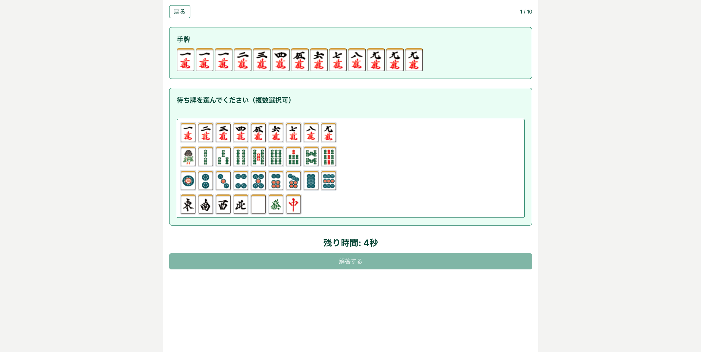

# Docomachi（どこまち）

麻雀の**聴牌の状態から待ち牌を当てる**クイズの Web アプリです。牌の組み合わせを見て正しい待ちを選び、学習・確認に使えます。

## このアプリについて

- **誰のため**: 麻雀の待ち牌・聴牌の練習をしたいプレイヤー向けです。
- **できること**: 出題された手牌（テンパイ形）に対し、待ち牌の候補から正解を選ぶクイズ形式で遊べます。
- **目的**: 聴牌判断の反復練習を通じて、待ちのパターンを身につけることです。

## 開発と仕様（Speckit）

本プロジェクトでは **Speckit**（Cursor のスラッシュコマンド）を使い、機能ごとに仕様・計画・タスクを整理しています。

- 例: `/speckit.specify` で仕様のたたき台を作成し、`/speckit.plan` で実装計画、`/speckit.tasks` でタスク一覧を生成します。
- 成果物はブランチに紐づく `specs/<番号>-<機能名>/` 配下に置かれます（`spec.md`、`plan.md`、`tasks.md` など）。
- テンプレートやスクリプトはリポジトリの `.specify/` にあります。

## インフラ（AWS Amplify Gen 2）

バックエンドとホスティングには **AWS Amplify Gen 2** を利用しています。

- **フロントエンド**: Next.js（App Router）
- **バックエンド**: サーバレス構成で **AWS AppSync**（GraphQL）、**Amazon DynamoDB**、必要に応じて **AWS Lambda** などを利用します。バックエンドの実装は **TypeScript** で統一しています。
- バックエンド定義はリポジトリの `amplify/` にあります。

## 技術スタック

主要な構成要素のみを示します。**全依存関係の一覧はリポジトリルートの `package.json` を参照**してください。

| 区分 | 主な技術 | 用途の目安 |
|------|-----------|------------|
| UI・ルーティング | Next.js、React | Web アプリ本体 |
| 言語 | TypeScript | 型付き開発 |
| スタイル | Tailwind CSS、PostCSS | レイアウト・見た目 |
| AWS クライアント | `aws-amplify`、`@aws-amplify/ui-react` | 認証・API 連携など |
| バックエンド定義 | `@aws-amplify/backend`、AWS CDK 関連 | Amplify Gen 2 のインフラ定義 |
| 品質 | ESLint、Prettier（Husky でコミット前実行）、Jest | 静的解析・整形・テスト |
| UI 部品 | Radix UI、Sonner など | ダイアログ・トーストなど |

## 画面キャプチャ

トップページの表示イメージ（スタートとプレイ中の画面）です。アプリの見た目は機能追加・変更に応じて差し替えてください。




## ローカルでの起動

```bash
npm install
npm run dev
```

ブラウザで `http://localhost:3000` を開いて動作を確認できます。Amplify 連携が必要な機能を試す場合は、環境に応じて `amplify_outputs.json` の配置などが必要です。

## ライセンス・コントリビューション

- ライセンス: [LICENSE](LICENSE)
- コントリビューション: [CONTRIBUTING](CONTRIBUTING.md)
- 行動規範: [CODE_OF_CONDUCT.md](CODE_OF_CONDUCT.md)

## セキュリティ

脆弱性の報告については [CONTRIBUTING](CONTRIBUTING.md) のセキュリティ通知を参照してください。
